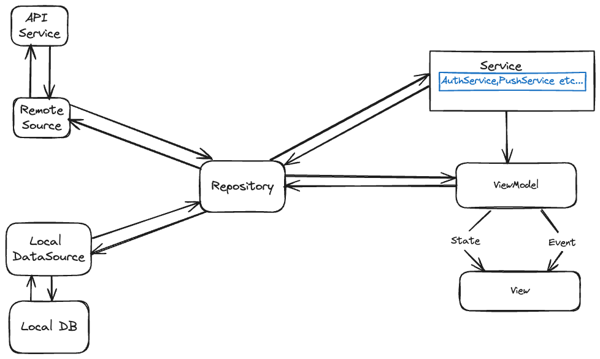

# Architecture <!-- {docsify-ignore-all} -->

Welcome to the Architecture section of XYZ's Flutter boilerplate template. Here, we will delve into the architectural pattern we've adopted, specifically the MVVM (Model-View-ViewModel) with BLoC (Business Logic Component), and explain how it's implemented in our project.

## Overview 

- **View**: Represents the user interface of the application. It is responsible for displaying the data and capturing user interactions. The View observes the ViewModel for changes and updates itself accordingly.

- **BLOC**: Handles the state management and business logic of the application. It receives events from the View, processes them, and emits new states. The View observes the BLoC for state changes and updates itself accordingly.

- **Repository**: Acts as a mediator between the ViewModel(Bloc) and the Data Layer. It retrieves, manages, and transforms data, hiding implementation details from the ViewModel.

- **DataLayer**: Encompasses data access mechanisms like local database, API calls, and file I/O. It interacts with external data sources like APIs and databases.

## Data Flow 

1. User interacts with the View, triggering an Event.
2. View dispatches the Event to the ViewModel (Bloc).
3. ViewModel processes the Event using business logic and interacts with the Repository.
4. Repository retrieves or modifies data from the Data Layer.
5. ViewModel receives updated data or State from the Repository.
6. ViewModel emits the new State through a Stream.
7. View listens to the Stream and updates its UI based on the latest State.

## Conclusion 

This architecture pattern provides a solid foundation for developing modular, testable, and maintainable Flutter applications. By adhering to the chosen patterns and SOLID principles, we ensure a sustainable and scalable app development process for the XYZ boilerplate project.

