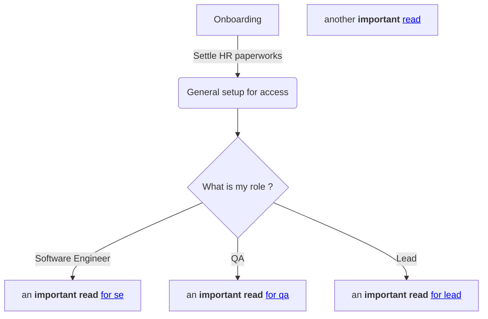

# Npm Accesses

If you had cloned the repository and try to do `npm install` or equivalent command . You will hit alot of permission issue like 401.

Below steps are necessary. The goal is to setup your azure devops artifacts with your PAT(personal access token) so you have a legit access `.npmrc` file.

1. Ensure you had installed npm and node. Request all the permissions earlier.
2. Go Azure devops . https://dev.azure.com/picklesauctions/Identity%20Server/_artifacts/feed/Npm_packages/connect/
3. Follow the steps by clicking on artifacts >npm > Connect to feed > npm,
4. You should see like below.

    

        
    

5. Now follow the step to setup `PAT` PERSONAL ACCESS TOKEN.
6. Update your `.npmrc` file in `/users/your-user-name/.npmrc` with this access
7. Now your `npm install` should work
8. See Mermaid example

