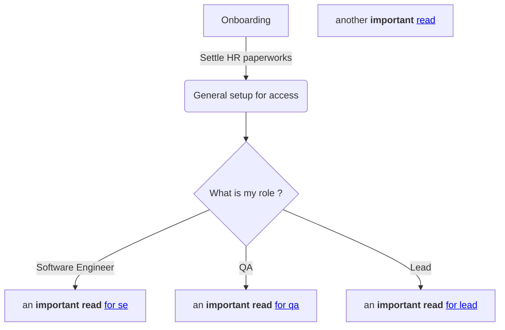

# Mermaid example
1. See Mermaid example

```mermaid
flowchart TD
    A[Onboarding] -->|Settle HR paperworks| B(General setup for access)
    B --> C{What is my role ?}
    C -->|Software Engineer| C1[Do this first]
    C -->|QA| C2[Do this first]
    C -->|Lead| C3[Do this first] 
    C1[an <b>important read</b> <a href='http://google.com'>for se</a>]  
    C2[an <b>important read</b> <a href='http://google.com'>for qa </a>]  
    C3[an <b>important read</b> <a href='http://google.com'>for lead</a>]
    D1[another <b>important</b> <a href='http://google.com'> read</a>]
    click B "#/docs/resource_accesses" "This is a tooltip for a link"
```